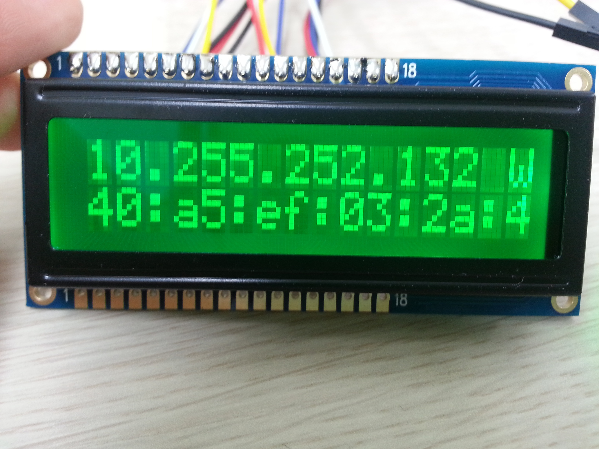
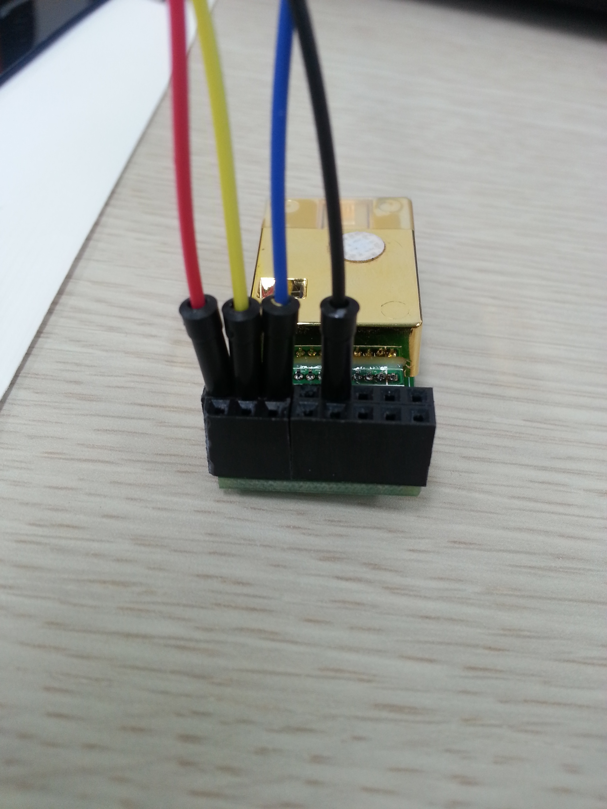
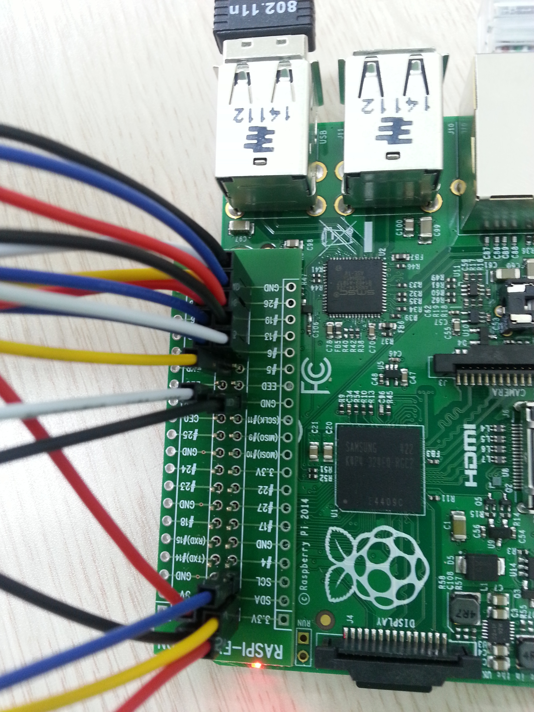
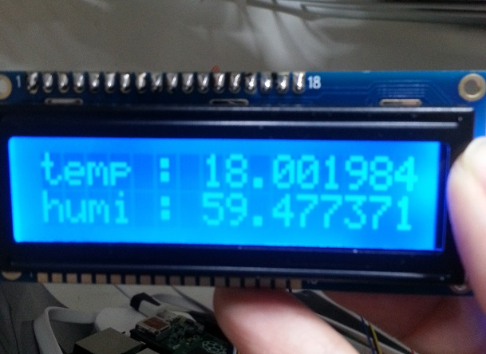
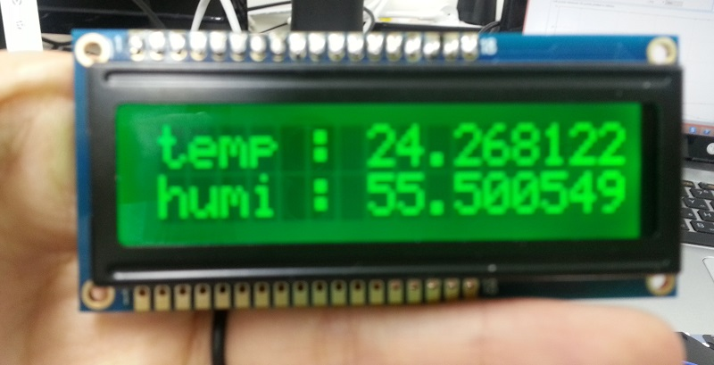
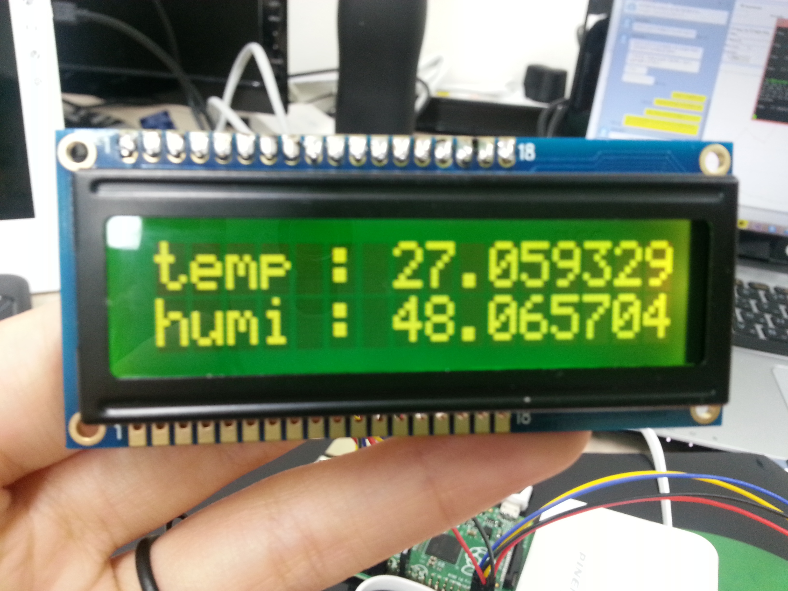
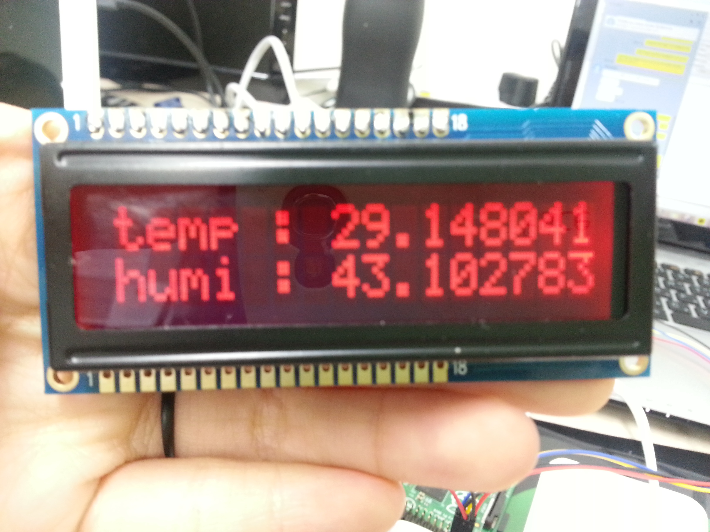
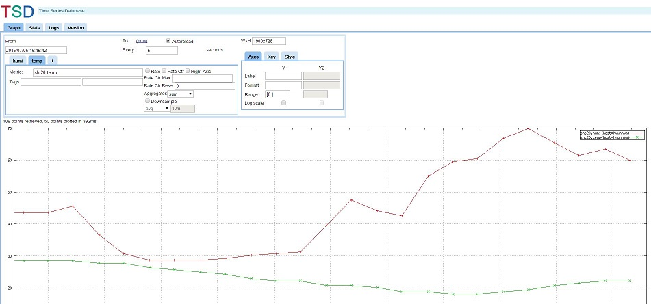

#150706 스터디#

##1.Markdown 문법 익히기##
- 참고 : http://sergeswin.com/1013

##2. LCD와 온습도 센서 연결하기##
- LCD에서는 연결된 상태를 표시하고, 온습도 센서를 이용해서 데이터 읽어들이기

- LCD 연결

        150703 스터디 기록 확인
        

-온습도 센서 연결

        http://www.sensirion.com/fileadmin/user_upload/customers/sensirion/Dokumente/Humidity/Sensirion_Humidity_SHT20_Datasheet_V3.pdf
        
| 온습도 pin(with CO2) | 온습도 pin (only) | Function           | RasPi pin |
|:--------------------:|:-----------------:|--------------------|-----------|
|           2          |         1         | SDA                | SDA       |
|           5          |         2         | VSS                | GND       |
|           -          |         3         | NC (Not Connected) | -         |
|           -          |         4         | NC (Not Connected) | -         |
|           1          |         5         | VDD                | 3.3V      |
|           3          |         6         | SCL                | SCL       |

  
-온습도 센서 연결 후 설정(Setup)

        https://learn.adafruit.com/adafruits-raspberry-pi-lesson-4-gpio-setup/configuring-i2c 참고
        
        패키지 설치
        sudo apt-get install python-smbus
        sudo apt-get install i2c-tools
        
        raspi-config
        8. advanced options
        A7 I2C
        
        Edit modules file
        sudo nano /etc/modules
        
        i2c-bcm2708
        i2c-dev
        추가
        
-온습도 센서 연결 확인

        sudo i2cdetect 1
        
-작동

        sudo python sht20.py
        

##3.LCD 응용##

- 처음에 연결 상태를 나타내고, 그 다음에 온도와 습도를 표시해준다.
- 온도와 습도를 표시할 때에는 온도에 따라 색이 달라진다.

        22도 이하 : 파랑 
        22도 이상 27도 이하 : 초록 
        27도 이상 29도 이하 : 노랑 
        29도 이상 : 빨강
        
- sudo python sht20_lcd.py 으로 실행
 
- 실행 화면

- 22도 이하일때  

- 22도 이상 27도 이하일때

- 27도 이상 29도 이하일때

- 29도 이상일때

- 온습도 변화 그래프

