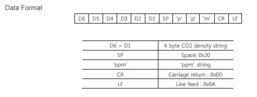
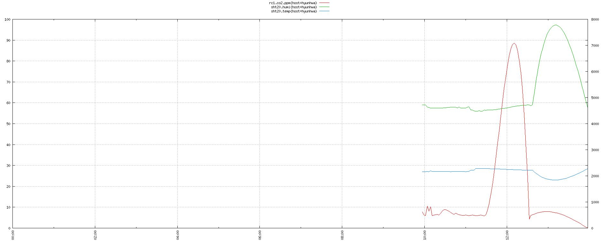
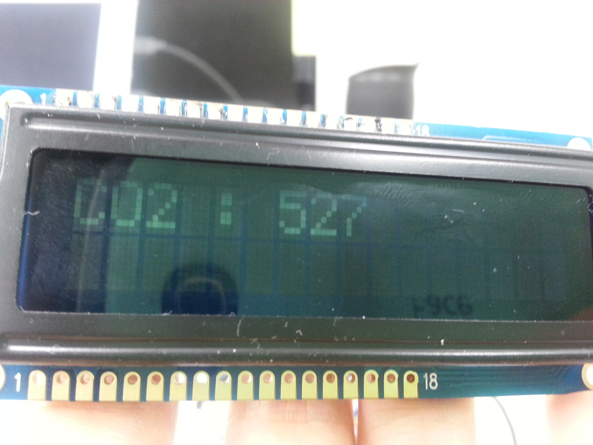
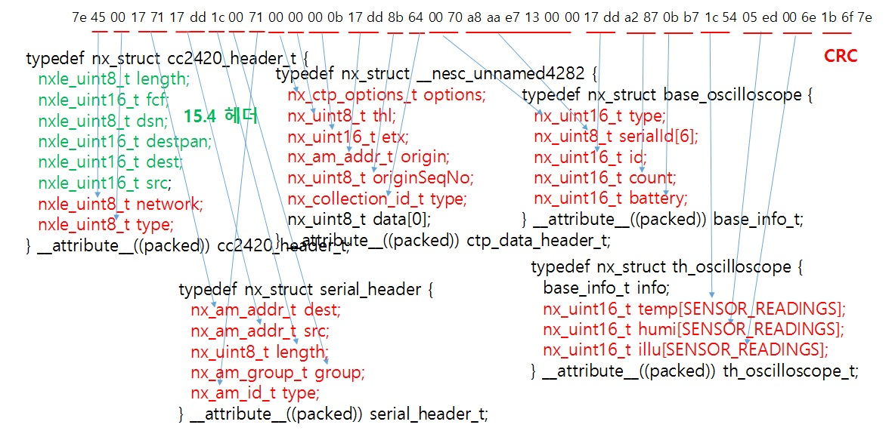

#150707 스터디#

##1. LCD 소스 공부##

- awk '{print $2}' (참고 사이트 : http://www.myservlab.com/92 ) 

        awk 기능 : 검색한 내용의 일부를 추출  
        awk 기본 문법 : awk <search pattern> {<program actions>}  
        $1 : 첫 번째 필드를 검색할 것임을 지정  
        ~ : 문자로 해당 필드에서 문자열을 검색할 것임 / !~ : 특정 문자열을 검색 결과에서 제외  
        ^ : 줄의 시작 부분을 검색 / $ : 끝 부분을 검색  

- cut -d/ -f1 (참고 사이트 : http://bbolmin.tistory.com/32 )  

        cut 기능 : 파일에서 필드 추출. 필드는 구분자로 구분  
        cut 기본 문법 : cut [option] [file]  
        -c [문자위치] :잘라낼 곳의 글자 위치를 지정  
        -f : 잘라낼 필드를 정한다.  
        -d [구분자] : 필드를 구분하는 문자를 지정. 디폴트는 탭 문자.  
        -s : 필드 구분자를 포함할 수 없다면 그 행은 하지 않는다.  

- 문자열 슬라이싱

         [시작위치:끝위치]
         앞에서 부터 시작하면 0부터 시작 / 뒤에서부터 시작하면 -1부터 시작
         [인덱스:] : 뒷방향으로 읽기
         [:인덱스] : 앞방향으로 읽기
        

#150708 스터디#
##1.CO2 센서&온습도 센서##

- 센서 연결  

         CO2 센서의 1,3,5 번 -> 라즈베리파이의 5V,GND,RXD에 연결
         온습도센서의 1,2,3,5번 ->라즈베리파이의 3.3V,SDA,SCL,GND에 연결
         LCD 연결 6,7,8번 ->라즈베리파이의 17,27,22에 연결
         
         빵판을 이용해서 5V 나눠주면 LCD 불도 들어옴 => 미완성
         
- LCD + Sht20 + CO2 코드 구현/공부

         sht20 DataSheet
         http://www.sensirion.com/fileadmin/user_upload/customers/sensirion/Dokumente/Humidity/Sensirion_Humidity_SHT20_Datasheet_V3.pdf
         
         co2 DataSheet
         http://eltsensor.co.kr/2012/eng/pdf/T-110/DS_T-110-3V_ver1.210.pdf
         
         co2 data format

- 수집 결과
 

- 결과 화면
         기존에 IP, MAC, 온도, 습도 수치에 이어서

- sudo screen -dmS [스크린명] [명령] : 해당 명령을 screen 으로 수행
- sudo screen -r [스크린명] : 해당 screen 에 접근 (Ctrl+C로 kill)

#150709 스터디#
##1. Hue 관련 코드 공부##
- hue.py 소스 참고
		- 각 소스들이 작동하는 과정 이해.
		- 데이터가 이동하고 변경되는 원리 이해.
		- 주어진 함수들을 이용해서 간단하게 사용자가 변경할 수 있는 메뉴환경 만들기.
		
         
##2. 라즈베리와 센서간의 무선통신 조사##

#150710 스터디#
##1.라즈베리와 센서간의 무선통신 소스 공부##
- sec_serial_ttyUSB0.py 참고
	 	- ttyUSB0를 통해서 정보들이 수집되는 과정을 이해하기
		- 수집된 packet을 sese()함수를 이용해 분리해서 각 타입에 맞는 센서 값을 읽어들인다.
        - 그리고 타입에 맞는 계산법을 이용해서 온도, 습도, CO2농도를 결정한다.
            
        - 현재 연구실에 설치된 센서들을  검지해보았을 때는 주로 0070 type이 검출됨.
            
        - 온습도 datasheet의 "9. Compatibility to SHT1x / 7x protocol"에 따르면
          온도는 ==-46.85 + 175.72 * float(temperature) / pow(2,14)==
          습도는 ==-6 + 125 * float(humidity) / pow(2,12)==
          식으로 구해진다는 것을 알 수있다.
            
- 수집되는 packet의 형태

- sht20 센서 datasheet : http://www.sensirion.com/fileadmin/user_upload/customers/sensirion/Dokumente/Humidity/Sensirion_Humidity_SHT20_Datasheet_V3.pdf

##2.각종 센서들의 데이터를 스니핑하는 소스 실습##
- packet_print.py 참고
		- sudo python packet_print.py [serial device] 로 실행하면 해당 디바이스를 통해 스니핑 가능.
		- 스니핑 한 패킷의 format에 맞춰서 보여지게 됨.
		-  아직 코드 이해가 더 필요함.

##3.두가지를 이용해서 할만한 것##
- 무선으로 패킷들을 검출해내서 데이트베이스에 저장 후 
	값들을 이용한 행동패턴 분석도 가능할 것 같다.
    
- 무선으로 검출해내서 센서 값에 따라서 
	온도가 높으면 선풍기를 돌린다거나  LED 또는 LCD로 알림을 준다
    
- 실시간으로 변화되는 값들을 웹페이지 상에서 볼 수 있도록 만든다.
