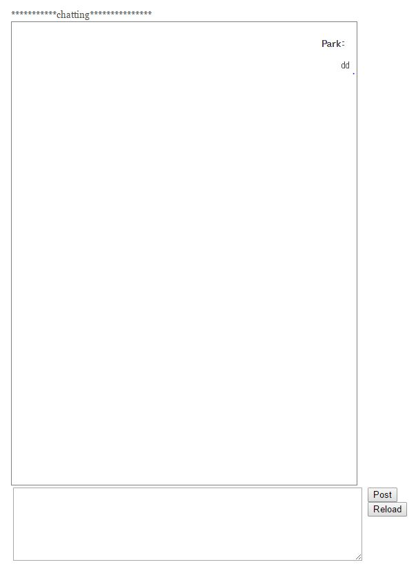
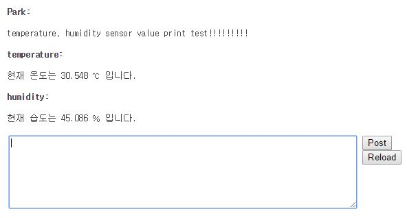
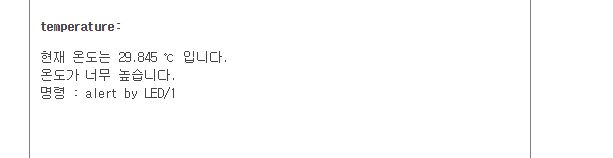
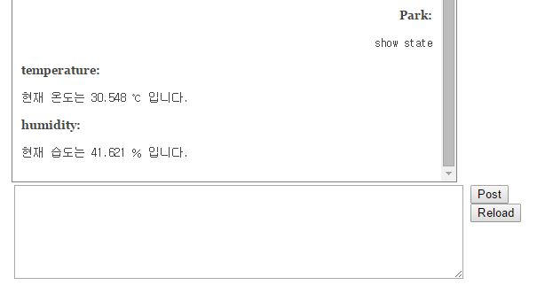
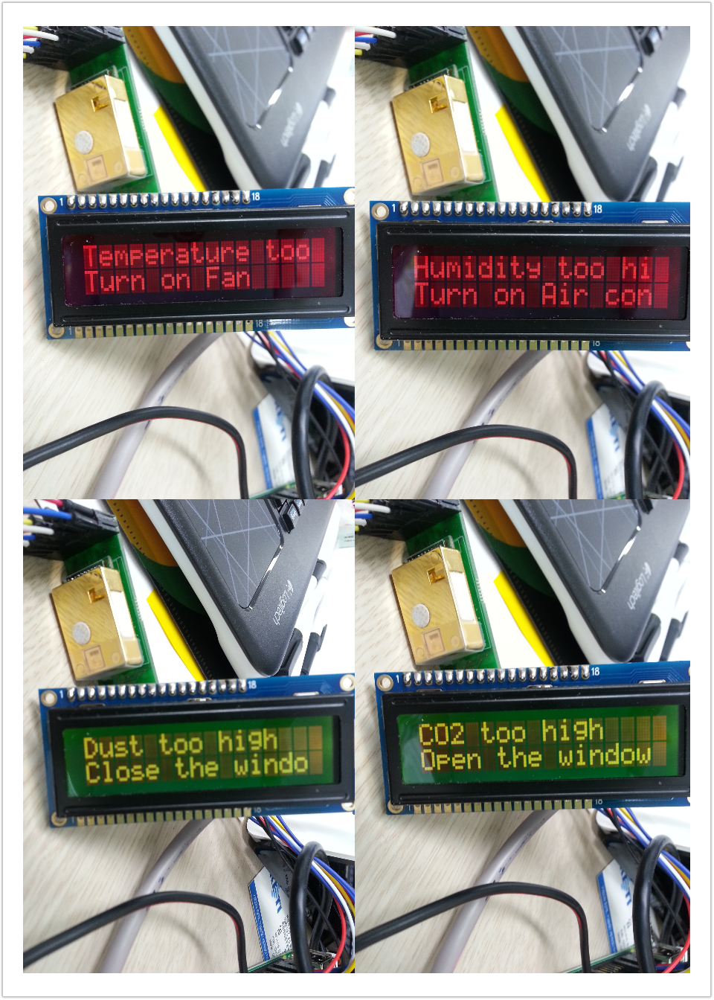

#6주차/7주차 스터디#
##1.다양한 예제를 수행할 홈페이지 형식 결정##
- 주어지는 plugin 중에서 하나 선택함.
- 추가 된 메뉴

	1) 회원 목록 확인하기
    2) 채팅 목록 확인하기
    3) 채팅 창
    4) openTSDB 연결된 페이지
    
##2. 채팅 기반 마련하기##
- 참고 url : https://github.com/rpedroso/w2pchat

1) 채팅 레이아웃 결정하기
내가 입력한 글은 오른쪽 정렬  되고 센서들이 보내는 글은 왼쪽 정렬하기

		
2) `Reload 버튼`을 눌렀을 때 현재 온습도 알려주기

3) `Reload 버튼`을 눌렀을 때 기준치 이상의 값이 감지 될 때만 알려주기
추가적으로 할 수 있는 명령 안내하기

4) 사용자가 특정 명령을 하였을 때  (`show state`) 현재 온습도 알려주기

5) 사용자가 특정 명령을 하였을 때  (`show state`) 온습도 값 외에 추가적으로 CO2 센서 감지하고, 먼지 농도 불러와서 표시하기

6) 특정 명령을 하였을 때 (`alert by LCD/1`) 관련된 알림을 LCD로 전달해서 표시하기

7)백그라운드에서 항상 수행되는 python 코드를  구성하여 데이터를 별다른 명령 없이도 수행하기
- 참고 url : http://web2py.com/books/default/chapter/29/04/the-core#Running-tasks-in-the-background
- cron을 이용하는 방법을 구상중..
- 진행중

8)명령을 LCD로 전달 할 때 알림음 실행하기
- 진행중
