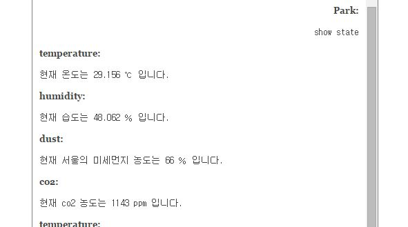

#6주차/7주차 스터디#
##1.다양한 예제를 수행할 홈페이지 형식 결정##
- 주어지는 plugin 중에서 하나 선택함.
- 추가 된 메뉴

	1) 회원 목록 확인하기
    2) 채팅 목록 확인하기
    3) 채팅 창
    4) openTSDB 연결된 페이지
    
##2. 채팅 기반 마련하기##
- 참고 url : https://github.com/rpedroso/w2pchat

#1) 채팅 레이아웃 결정하기#
내가 입력한 글은 오른쪽 정렬  되고 센서들이 보내는 글은 왼쪽 정렬하기

		
#2) `Reload 버튼`을 눌렀을 때 현재 온습도 알려주기#

#3) `Reload 버튼`을 눌렀을 때 기준치 이상의 값이 감지 될 때만 알려주기#
추가적으로 할 수 있는 명령 안내하기

#4) 사용자가 특정 명령을 하였을 때  (`show state`) 현재 온습도 알려주기#

#5) 사용자가 특정 명령을 하였을 때  (`show state`) 온습도 값 외에 추가적으로 CO2 센서 감지하고, 먼지 농도 불러와서 표시하기#

#6) 특정 명령을 하였을 때 (`alert by LCD/1`) 관련된 알림을 LCD로 전달해서 표시하기#

- 문자열의 길이가 LCD보다 길 때는 가장 긴 문자열이 다 보일 때까지 흐르도록 함.

#7)백그라운드에서 항상 수행되는 python 코드를  구성하여 데이터를 별다른 명령 없이도 수행하기#

- 참고 url : http://web2py.com/books/default/chapter/29/04/the-core#Running-tasks-in-the-background

- cron을 이용하는 방법
	- web2py/application/[myweb]이 들어가면 cron이라는 폴더가 존재한다.
	
	- cron 폴더의 crontab 파일에 `@reboot reboot *mycontroller/myfunction`을 추가한다.
	(function을 추가할 수도 있고, 파일 자체를 추가할 수도 있다.)
	- `@reboot` 은 web2py가 시작할때 한번만 수행됨을 의미한다.
	
	- web2py를 실행하는 명령의 뒤에 `--run-cron`을 추가하면 web2py가 시작될때 background에서 설정한 작업이 수행된다.

- 백그라운드에서 실행하는 LCD 화면이 존재하고, 채팅으로 명령이 주어지면 해당 LCD 화면을 띄우는 것이 목적.

- 현재는 백그라운드에서 실행 화면과 명령 화면이 번갈아가면서 나타나는 것을 확인

- 이 부분을 수정하는 방안을 찾는 중.
	- lock을 걸어 임계영역을 설정해주는 방법을 적용중...

#8) Web2py 종료됨과 동시에 LCD 창도 종료되도록 하기.#

- LCD와 관련된 Web2py 작업을 수행하다 보니 Web2py가 꺼져도 LCD 창은 멈춰버리는 현상을 발견.

- 이를 해결하기 위해 web2py.py 파일을 수정하여 LCD와 GPIO 제어가 가능하도록 하여
	- `import RPIO.gpio as GPIO` 와 `from lcd import *` 를 추가

- KeyboardInterrupt가 발생하면 아래 작업을 수해하여 LCD를 정리하도록 함.

		lcd_byte(0x01, LCD_CMD)
    	lcd_string("Goodbye!",LCD_LINE_1,2)
    	GPIO.cleanup()

#9)명령을 LCD로 전달 할 때 알림음 실행하기#

- 진행중
