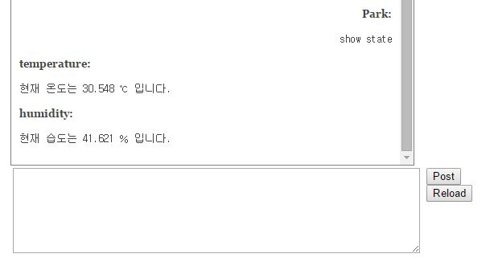

#6주차/7주차 스터디#
##1.다양한 예제를 수행할 홈페이지 형식 결정##
- 주어지는 plugin 중에서 하나 선택함.
- 추가 된 메뉴

	1) 회원 목록 확인하기
    	2) 채팅 목록 확인하기
    	3) 채팅 창
    	4) openTSDB 연결된 페이지
    
##2. 채팅 기반 마련하기##
- 참고 url : https://github.com/rpedroso/w2pchat

###1) 채팅 레이아웃 결정하기###
내가 입력한 글은 오른쪽 정렬  되고 센서들이 보내는 글은 왼쪽 정렬하기

		
###2) `Reload 버튼`을 눌렀을 때 현재 온습도 알려주기###

###3) `Reload 버튼`을 눌렀을 때 기준치 이상의 값이 감지 될 때만 알려주기###
추가적으로 할 수 있는 명령 안내하기

###4) 사용자가 특정 명령을 하였을 때  (`show state`) 현재 온습도 알려주기###

###5) 사용자가 특정 명령을 하였을 때  (`show state`) 온습도 값 외에 추가적으로 CO2 센서 감지하고, 먼지 농도 불러와서 표시하기###

###6) 특정 명령을 하였을 때 (`alert by LCD/1`) 관련된 알림을 LCD로 전달해서 표시하기###

- 문자열의 길이가 LCD보다 길 때는 가장 긴 문자열이 다 보일 때까지 흐르도록 함.

###7)백그라운드에서 항상 수행되는 python 코드를  구성하여 데이터를 별다른 명령 없이도 수행하기###

- 참고 url : http://web2py.com/books/default/chapter/29/04/the-core#Running-tasks-in-the-background

- cron을 이용하는 방법
	- web2py/application/[myweb]이 들어가면 cron이라는 폴더가 존재한다.
	
	- cron 폴더의 crontab 파일에 `@reboot reboot *mycontroller/myfunction`을 추가한다.
	(function을 추가할 수도 있고, 파일 자체를 추가할 수도 있다.)
	- `@reboot` 은 web2py가 시작할때 한번만 수행됨을 의미한다.
	
	- web2py를 실행하는 명령의 뒤에 `--run-cron`을 추가하면 web2py가 시작될때 background에서 설정한 작업이 수행된다.

- 백그라운드에서 실행하는 LCD 화면이 존재하고, 채팅으로 명령이 주어지면 해당 LCD 화면을 띄우는 것이 목적.

- 백그라운드에서 계속 현재 상태를 나타내는 프로그램이 수행되고, 명령이 전달되면 LCD에 알림을 주는 기능.

 1) 전역변수를 선언하여 값을 공유하여 임계영역을 설정해주는 방법
	
	- cron으로 실행되는 controller 함수와 채팅창의 명령으로 실행되는 module의 함수가 값을 공유하지 않는 것으로 판단.
	
 2) current를 이용하여 값을 공유하여 임계영역을 설정해주는 방법
    
    - global object에는 request,response,session,cache,T 등이 있다.

    - module들은 application에서 호출 될 때만 global object에 접근할 수 있기 때문에 current라는 컨테이너를 사용하게 된다.
    	- `from gluon import current` 를 import 해야하고
    	- `current.request/response/session/cache/T `와 같은 방법으로 사용할 수 있다.
		- `current.[변수]=[변수]` 와 같은 식으로 다른 변수를 저장할 수도 있고
		- `[변수]=current.[변수]` 로 불러올 수도 있다.

	- 하지만 이 방법도 원인은 conroller에서 변경한 값이 module에서는 적용되지 않는 것으로 확인이 되었다.

	- 프로세스의 차이는 아닐까하는 생각을 해보는 중...

 3) DB를 생성항여 값을 공유하여 임계영역을 설정해주는 방법

	- 사실 가장 쉬운 방법이지만 좀 더 다른 방법이 있는지 여러번 시도하다가 결국 DB를 생성하기로 마음 먹었다.
	- db.py

			db.define_table('phh_order',
                Field('phh_order_name'),
                Field('phh_order_value'))
     
    - seq_set.py
    
    	- `seq_num`는 대기번호를 나타내는 것으로, Background에서 corn이 수행되고 있을 때 seq_num가 1로 바뀌어 있다면 대기하고 있는 명령이 존재한다는 것으로 판단하여 하던 작업을 마무리 하고 잠시 대기 상태로 진입한다.

		- `lock`은 임계영역을 설정하기 위한 값으로 True일 경우에는 대기중인 명령이 끼어 들수 있게 만들기 위함이다. 자신이 수행할 것이 다 끝난 후에는 False로 만들어주어야한다.
		- `seq_init`은 Background 작업이 시작하기 전에 초기화 및 DB에 필요한 값이 존재하지 않을 경우에 insert하는 부분이다.

    			from gluon import *
				from gluon.globals import *

				def seq_init():
    				db = current.db
    				if db(db.phh_order.phh_order_name == 'number').isempty() :
        				db.phh_order.insert(phh_order_name='number',phh_order_value='0')
        				db.phh_order.insert(phh_order_name='lock',phh_order_value='False')
        				db.commit()
    				else :
        				db(db.phh_order.phh_order_name == 'number').update(phh_order_value='0')
        				db(db.phh_order.phh_order_name == 'lock').update(phh_order_value='False')
        				db.commit()
    
				def seq_getting():
    				db = current.db
    				num_row=db(db.phh_order.phh_order_name =='number').select().first()
    				seq_num=num_row.phh_order_value
    				return seq_num
	
				def seq_setting(number):
    				db = current.db
    				db(db.phh_order.phh_order_name == 'number').update(phh_order_value=number)
    				db.commit()
    
				def lock_getting():
    				db = current.db
    				lock_row=db(db.phh_order.phh_order_name =='lock').select().first()
    				is_lock = lock_row.phh_order_value
    				return is_lock
	
				def lock_setting(state):
  					db = current.db
    				db(db.phh_order.phh_order_name == 'lock').update(phh_order_value=state)
    				db.commit()

###8) Web2py 종료됨과 동시에 LCD 창도 종료되도록 하기.###

- LCD와 관련된 Web2py 작업을 수행하다 보니 Web2py가 꺼져도 LCD 창은 멈춰버리는 현상을 발견.

- 이를 해결하기 위해 web2py.py 파일을 수정하여 LCD와 GPIO 제어가 가능하도록 하여
	- `import RPIO.gpio as GPIO` 와 `from lcd import *` 를 추가

- KeyboardInterrupt가 발생하면 아래 작업을 수해하여 LCD를 정리하도록 함.

		lcd_byte(0x01, LCD_CMD)
    	lcd_string("Goodbye!",LCD_LINE_1,2)
    	GPIO.cleanup()

###9) 명령을 LCD로 전달 할 때 알림음 실행하기###

- pygame을 이용한 방법.
	- `import pygame` 을 선언하고

	-  `pygame.mixer.init()` 으로 초기화 해준 뒤

	-  `pygame.mixer.music.load("[절대경로]")`를 수행하면 해당 mp3 파일을 재생할 수 있는 환경이 완성된다.

	-  이 때 경로를 설정하는 것에 대해서 고민을 주로 하였는데

	-  명령으로 수행되든, 백그라운드에서 수행되든 상관없이 설정하기 위해서 절대경로를 사용하기로 하였다.

	-  그 후 `pygame.mixer.music.play()` 을 수행하면 재생이 시작되게 된다.

- pygame 과 관련된 더 자세한 정리는 [요기](https://github.com/park-hyun-hwa/sample/blob/master/study/3_study_0714.md)에  정리하였다.

###10) URL함수 이용하여 함수접근하기 ###

- Web2py의 장점 중에 하나가 Restful api를 지원한다는 것이고, URL 함수는 중요한 함수 중에 하나이다.

- URL 함수를 이용하여 action이나 static 파일에도 접근이 가능.

- `URL('application','controller','function',args=['x','y'],vars=dict(z='t'))`라고 지정하면 `/application/controller/function/x/y?z=t` 라는 url로 매핑된다.

- static 파일에 접근하고 싶을 때는 `URL('static','images/icons/arrow.png')` 라는 형식으로 접근이 가능.

- URL 함수는 단지 주소를 간편하게 매핑 시켜주는 역할.

- 나는 URL을 실행함으로써 반환되는 값을 이용하고 싶었기 때문에 `urllib2`에 있는 `urlopen`이라는 함수를 이용하기로 함.

- `urllib2.urlopen('주소').read()`를 이용하면 반환되는 값을 이용할 수 있다.

- DB를 이용하여서 값을 공유하는 방식을 쓰지 않고 위의 함수를 이용하여서 값을 공유하고자 하였으나

- set으로 바꾼후에 get을 하면 초기값으로 다시 설정되는 현상을 발견하게 되었다.

- urlopen을 새로 할 때마다 함수가 새롭게 열려서 발생하는 현상인 것으로 판단하였다.

- Web2py의 restful api라고 검색해본 결과 GET,POST,PUT 등과 같은 방식들이 db를 접근하는 방식으로 되어있는 것을 발견하였기 때문에 url 접근이 아닌 바로 db 값을 바꾸는 기존의 방식으로 돌아가기로 하였다.

###11) Log를 찍어서 진행상태 확인하기 ###

- `web2py/example`에 있는 `logging.conf`를 `web2py/`에 이동시킨다.

- 그 후에는 `web2py/logs` 에 `web2py.log` 라는 파일이 생성되게 된다.

- cron으로 실행되는 함수의 log를 확인하기 위해서 시작하였기 때문에 `logging.conf`에 있는 `cron 파트`를 약간 수정해야한다.

- [ logger_cron ] 파트에서 level에는 원래 WARNING으로 설정이 되어있으나

- DEBUG로 바꾸어주면 관련된 많은 log들을 확인 할 수 있다.

- log를 확인 할 시에 파일을 열면 필요한 부분은 아래쪽의 몇줄만 필요한 것이기 때문에 

- `tail -n [줄수] web2py.log`를 수행하면 아래쪽에서 원하는 줄 수 만큼 볼 수 있다.

- 또한 `tail -n [줄수] -f web2py.log`를 수행하면 실시간으로 쌓이는 것을 확인 할 수 있다.
